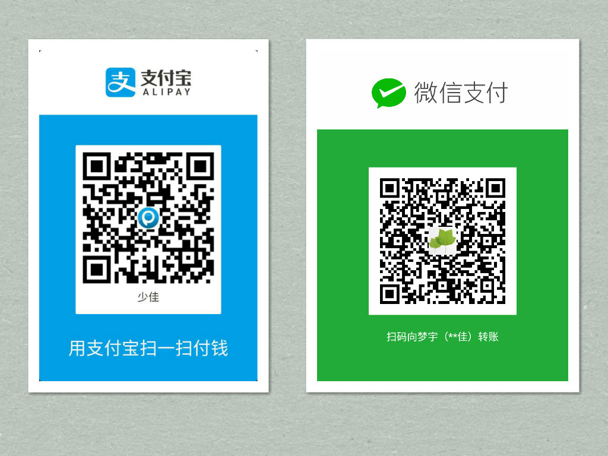

# FreeScreenRecorder
免费的录屏软件
说明：该项目使用JavaScript语言开发，运行环境为Electron。

## 软件使用说明视频

[http://www.tudou.com/programs/view/VaOLykdUX-g/](http://www.tudou.com/programs/view/VaOLykdUX-g/)

## 软件下载

**如果想要最新编译请自己编译**

### v1.0
[https://pan.baidu.com/s/1cHvSce](https://pan.baidu.com/s/1cHvSce)

这里提供了Mac、Windows、Linux三个平台的软件包，请根据自己的操作系统选择对应的软件下载。当然你也可以根据该源码自行打包软件。  

# 捐助

如果您觉得我的工作对您有所帮助，请支持我继续，谢谢。   

